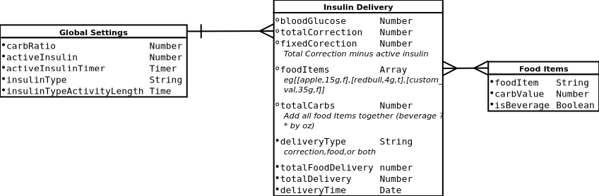
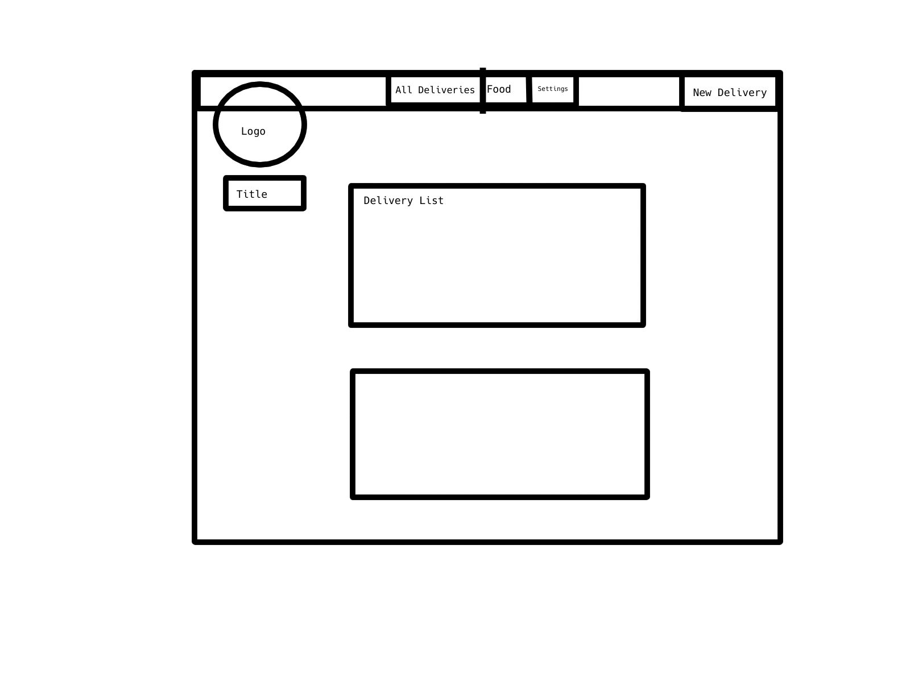

# closed-loop-pancreas-db
This is a database which holds food items with their carb value that can be used in another model to make insulin deliveries.
The insulin deliveries model takes a blood glucose in and calculates an insulin delivery based on it and the amout of food items added to the form from the food model.
Parameters are changed via a settings model ie. Carb Ratio and Correction Factor to display and log an insulin delivery.

## Technologies Used

  1. JavaScript
  2. Node/NPM
  3. MongoDB
  4. Handlebars
  5. Heroku
  6. HTML/CSS

### Features In Progress
  - Active Insulin (Data Points For it are there It is just a matter of syncing them with the global timer.)
  - Calorie King API (Will be used to Populate food Drop down in new delivery form)
  - Daily BG Average
  - Daily Insulin Total Average

## Uploaded To Heroku

[closed-loop-pancreas-db - Heroku App](https://closed-loop-pancreas.herokuapp.com/)
[Project Board](https://github.com/greattechpk/closed-loop-pancreas-db/projects/1)

### ERD Image

### Wirframe Image

